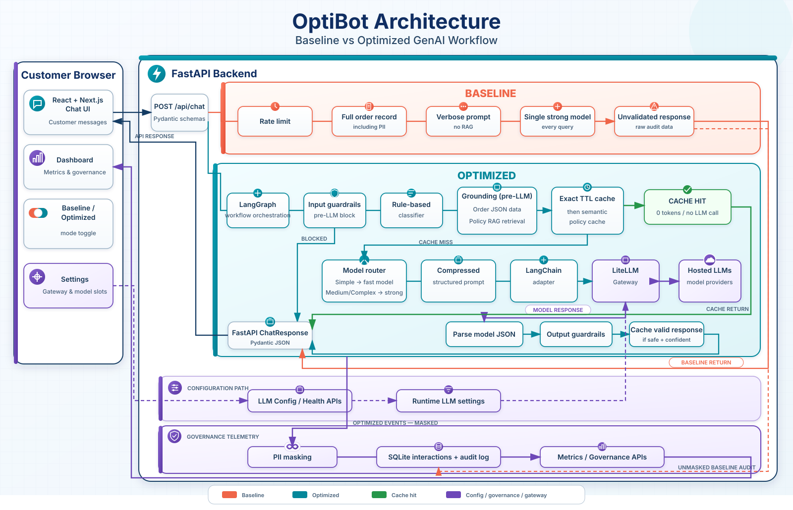

# OptiBot Backend Code Walkthrough

OptiBot is a FastAPI application exposing two side-by-side chat pipelines:

- `baseline`: deliberately unoptimized, expensive, and minimally governed.
- `optimized`: guardrails, classification, grounded data/RAG, caching, model routing, output validation, and masked auditing.

The primary endpoint is:



```http
POST /api/chat
Content-Type: application/json

{
  "message": "What is your return policy?",
  "mode": "optimized",
  "session_id": "demo-session"
}
```

## 1. Architecture

The optimized request flow is:

```text
HTTP request
  -> Pydantic validation
  -> LangGraph session restoration
  -> Input guardrails
  -> Rule-based classification
  -> Order-data resolution
  -> Policy RAG
  -> Exact/semantic cache lookup
      -> hit: return without LLM
      -> miss: select model
  -> Build optimized prompt
  -> LangChain model adapter
  -> LiteLLM gateway
  -> Parse structured response
  -> Output guardrails
  -> Cache valid response
  -> Mask PII for persistence
  -> Record metrics and audit event
  -> HTTP response
```

## 2. Project layout

```text
backend/
|-- app/
|   |-- main.py                   FastAPI application and startup
|   |-- config.py                 Environment-based configuration
|   |-- llm_settings.py           Mutable LiteLLM runtime configuration
|   |-- models/
|   |   `-- schemas.py            API request/response models
|   |-- routers/
|   |   |-- chat.py               Main chat endpoint
|   |   |-- health.py             Health and sample-order endpoints
|   |   |-- llm_config.py         Gateway/model settings endpoints
|   |   `-- metrics.py            Dashboard and audit endpoints
|   |-- services/
|   |   |-- chat_service.py       Main pipeline orchestration
|   |   |-- classifier.py         Query classification
|   |   |-- guardrails.py         Input and output guardrails
|   |   |-- order_service.py      Structured order grounding
|   |   |-- rag_service.py        Policy ingestion and retrieval
|   |   |-- embeddings.py         Embedding implementations
|   |   |-- cache_service.py      Exact and semantic caching
|   |   |-- gptcache_backend.py   Optional GPTCache backend
|   |   |-- prompts.py            Baseline and optimized prompts
|   |   |-- llm_client.py         Routing, parsing, and pricing
|   |   |-- langchain_model.py    LangChain model adapter
|   |   |-- gateway.py            LiteLLM transport
|   |   |-- pii_detector.py       PII detection and masking
|   |   `-- metrics_service.py    SQLite metrics and audit trail
|   `-- data/
|       |-- orders.json
|       |-- customers.json
|       |-- shipments.json
|       |-- products.json
|       `-- policies/*.md
|-- tests/
|-- requirements.txt
`-- .env
```

## 3. Application startup

The entry point is `backend/app/main.py`.

FastAPI is constructed with a lifespan context manager:

```python
@asynccontextmanager
async def lifespan(_: FastAPI):
    metrics_service.init_db()
    chunks = rag_service.build_index()

    log.info("embedding backend: %s", backend_name())
    log.info("policy index ready: %d chunks", chunks)
    yield
```

Before accepting requests, the backend:

1. Creates the SQLite tables.
2. Reads and chunks the policy documents.
3. Generates policy embeddings.
4. Loads the in-memory vector store.
5. Reports the active embedding backend.
6. Resolves the configured LiteLLM models and pricing.
7. Warns when the gateway API key is absent.

The application registers four routers:

```python
app.include_router(health.router)
app.include_router(chat.router)
app.include_router(metrics.router)
app.include_router(llm_config.router)
```

The configured CORS origins default to `http://localhost:3000` and
`http://127.0.0.1:3000`.

## 4. Configuration

There are two configuration layers.

### Static environment configuration

`backend/app/config.py` loads values from `backend/.env` at process startup.

Important settings include:

```text
LITELLM_BASE_URL
LITELLM_API_KEY
LITELLM_MODEL_BASELINE
LITELLM_MODEL_SIMPLE
LITELLM_MODEL_COMPLEX

OPTIBOT_CACHE_THRESHOLD
OPTIBOT_CACHE_TTL_ORDER
OPTIBOT_CACHE_TTL_POLICY
OPTIBOT_SEMANTIC_CACHE_BACKEND

OPTIBOT_RAG_TOP_K
OPTIBOT_RAG_MIN_SCORE
```

Defaults include:

```python
max_tokens_baseline = 1024
max_tokens_optimized = 700
cache_threshold = 0.80
cache_ttl_order = 300
cache_ttl_policy = 1800
rag_top_k = 3
rag_min_score = 0.15
max_input_chars = 500
rate_limit_per_minute = 20
low_confidence_threshold = 0.7
```

### Runtime LLM configuration

`backend/app/llm_settings.py` lets the UI change the gateway base URL, model
aliases, and API key while the backend is running.

Resolution follows this precedence:

```text
Persisted runtime selection
  -> environment variable
  -> built-in fallback
```

The built-in model slots are:

```python
{
    "baseline": "gemini-2.5-pro",
    "simple": "gemini-2.5-flash",
    "complex": "gemini-2.5-pro",
}
```

The base URL and aliases are saved to `backend/llm_runtime.json`. The API key
is held in memory and is deliberately never written to this file.

`normalize_base_url()` removes a trailing `/v1`, preventing an accidental
`/v1/v1/chat/completions` URL. Runtime configuration writes use a temporary
file followed by `os.replace()` for atomic replacement.

## 5. API contracts

The Pydantic models live in `backend/app/models/schemas.py`.

### ChatRequest

```python
class ChatRequest(BaseModel):
    message: str = Field(..., min_length=1, max_length=2000)
    mode: Literal["baseline", "optimized"] = "optimized"
    session_id: str = Field(default="demo-session", max_length=64)
```

Pydantic rejects invalid modes, empty messages, and oversized session IDs
before the pipeline executes.

### ChatResponse

```python
class ChatResponse(BaseModel):
    response: str
    metrics: ChatMetrics
    trace: list[TraceStep]
    sources: list[str]
    error: str | None
```

`ChatMetrics` carries the selected model, classification tier, token counts,
latency, cost, cache status, RAG status, confidence, guardrail events, PII
categories, and blocked status.

## 6. Chat endpoint

The endpoint in `backend/app/routers/chat.py` is intentionally thin:

```python
@router.post("/chat", response_model=ChatResponse)
def chat(request: ChatRequest) -> ChatResponse:
    return chat_service.handle(
        request.message,
        request.session_id,
        request.mode,
    )
```

Gateway failures are represented in `ChatResponse.error` rather than being
raised as HTTP 500 errors. This lets the dashboard display and audit failed
interactions.

## 7. Pipeline dispatch and LangGraph state

Dispatch happens in `backend/app/services/chat_service.py`:

```python
def handle(query: str, session_id: str, mode: str) -> ChatResponse:
    if mode == "baseline":
        return _run_baseline(query, session_id)

    masked_query = pii_detector.mask(query).text
    result = optimized_workflow.invoke(
        {
            "messages": [HumanMessage(content=masked_query)],
            "current_query": query,
            "session_id": session_id,
        },
        config={"configurable": {"thread_id": session_id}},
    )
    return result["response"]
```

Baseline calls its pipeline directly. Optimized mode invokes LangGraph and
uses `session_id` as the LangGraph `thread_id`.

The graph state is:

```python
class OptimizedState(MessagesState):
    current_query: str
    session_id: str
    response: ChatResponse
```

The graph contains a single orchestration node:

```python
builder = StateGraph(OptimizedState)
builder.add_node("optimized_pipeline", _execute_optimized)
builder.add_edge(START, "optimized_pipeline")
builder.add_edge("optimized_pipeline", END)

optimized_workflow = builder.compile(
    checkpointer=InMemorySaver()
)
```

`_message_history()` takes up to eight earlier messages. Only PII-masked
content is written into the LangGraph checkpoint.

Because `InMemorySaver` is used, conversation state survives between requests
in the same backend process but disappears after a restart and is not shared
between multiple workers.

## 8. Baseline pipeline

The baseline flow is:

```text
Rate limit
  -> Extract first order ID
  -> Load complete order/customer/shipment record
  -> Build verbose prompt
  -> Always select the baseline model
  -> Call the LLM
  -> Return output without validation
  -> Persist the interaction
```

Its weaknesses are deliberate:

- No injection or abusive-language blocking.
- No RAG for policy questions.
- No response cache.
- No complexity classification.
- No model routing by tier.
- Full records may enter the prompt.
- No structured-response contract.
- No factual output verification.
- Persistence may contain unmasked PII.

The baseline is a comparison arm, not the secure production path.

## 9. Optimized pipeline

The optimized pipeline starts in `_run_optimized()`.

### 9.1 Input guardrails

`guardrails.check_input()` checks:

- Empty input
- Per-session rate limit
- Prompt-injection expressions
- System-prompt extraction attempts
- Role switching and jailbreak language
- Data-exfiltration requests
- Credential requests
- Abusive language
- Maximum input length

For example, `You are a shit` produces a blocked `InputVerdict` with the
`abusive_language` trigger. The blocked branch returns before classification,
retrieval, cache lookup, or an LLM call.

### 9.2 Classification

`backend/app/services/classifier.py` uses deterministic regular expressions to
identify policy, order, dispute, escalation, and multi-intent language.

It returns:

```python
Classification(
    tier="simple" | "medium" | "complex",
    order_ids=[...],
    needs_rag=True | False,
    needs_order_data=True | False,
    should_escalate=True | False,
    reason="...",
)
```

Examples:

| Query | Tier | Order data | RAG |
|---|---:|---:|---:|
| `Where is ORD-10042?` | simple | yes | no |
| `What is your return policy?` | medium | no | yes |
| `ORD-10042 never arrived and I want a manager` | complex | yes | yes |

Classification is local and rule-based, so routing never requires a separate
LLM call.

### 9.3 Order grounding

`backend/app/services/order_service.py` loads the JSON datasets once and
indexes them by order, customer, shipment, and product ID.

`extract_order_ids()` normalizes values such as `ORD-10042`, `ORD 10042`, and
`ord-10042` to the same ID.

The optimized order context contains only relevant fields:

```python
{
    "order_id": "ORD-10042",
    "status": "In Transit",
    "estimated_delivery": "...",
    "shipping_method": "...",
    "carrier": "FedEx",
    "tracking_number": "...",
    "latest_tracking_scan": "...",
    "ship_to_city": "...",
}
```

Unknown IDs generate an `unknown_order_id` guardrail event.

### 9.4 Policy RAG

`backend/app/services/rag_service.py` builds the policy index.

At startup it:

1. Reads every Markdown policy file.
2. Splits content using Markdown headings.
3. Applies a recursive character splitter.
4. Generates a stable SHA-256 chunk ID.
5. Embeds every chunk.
6. Inserts the chunks into `InMemoryVectorStore`.

On a policy query, it retrieves more candidates than needed, filters candidates
below `rag_min_score`, and reranks the remainder using vector score, lexical
overlap, and a repeated-source penalty. The best `rag_top_k` chunks are sent to
the prompt.

### 9.5 Embeddings

`backend/app/services/embeddings.py` first attempts to use:

```text
sentence-transformers/all-MiniLM-L6-v2
```

If loading fails, the backend uses a local 512-dimensional lexical embedder.
The fallback removes stopwords, folds e-commerce synonyms, hashes unigrams and
bigrams, and L2-normalizes the resulting vector.

Example synonym folding includes:

```text
refund -> return
exchange -> return
tracking -> status
shipment -> order
guarantee -> warranty
```

The active backend is returned by `/api/health`.

## 10. Exact and semantic caching

Caching is implemented in `backend/app/services/cache_service.py`.

### Exact cache

The exact cache uses a bounded `OrderedDict`. Its identity includes:

- Cache schema version
- Mode
- Normalized query
- Classification tier
- Prompt version
- Guardrail version
- Hash of current order context
- Hash of retrieved policy chunks
- Relevant conversation context

Including the factual context means that a changed order status or changed
policy document invalidates the prior response automatically.

Exact normalization lowercases the query, collapses whitespace, and strips
trailing punctuation.

### Semantic cache

Semantic reuse is restricted to standalone policy and FAQ questions:

```python
semantic_allowed = (
    tier == "medium"
    and not order_contexts
    and not conversation_context
)
```

Order-specific and conversation-dependent answers are excluded to reduce the
risk of serving one customer's answer to another.

Semantic lookup:

1. Embeds the new query.
2. Considers entries with the same factual-context hash.
3. Calculates cosine similarity.
4. Requires similarity to meet the configured threshold.

The default threshold is `0.80`.

Example:

```text
First:  What is your return policy?
Second: Can you explain your return policy?
```

With the lexical fallback, this pair measures approximately `0.8018`, so the
second request can produce:

```text
cache_hit = true
cache_level = semantic
model = cache
total_tokens = 0
```

The cache stores only responses that are cacheable, have no output-guardrail
triggers, and have confidence at or above `0.7`.

Policy responses use a default TTL of 30 minutes. Order responses use five
minutes. The optional GPTCache backend uses SQLite scalar storage and FAISS
vector search while preserving the application's context-sensitive key.

## 11. Prompt construction

Prompts are located in `backend/app/services/prompts.py`.

### Baseline prompt

The baseline prompt is long and unstructured. It may include a complete raw
order record and contains no retrieved policy information or machine-readable
output contract.

### Optimized prompt

The optimized prompt requires:

```text
Role: ShopFast order support agent.

Task: Answer the customer using ONLY the Order Data and Policy Context below.
Output JSON only:
{"response": str, "confidence": 0.0-1.0, "sources": [str]}
```

Only the relevant context is included:

```text
Order query  -> compact Order Data
Policy query -> retrieved Policy Context
Mixed query  -> both
```

Self-contained policy questions omit unrelated conversation history from both
the prompt and cache identity, allowing stable cache reuse.

## 12. Model selection and completion

`backend/app/services/llm_client.py` selects models as follows:

```python
if mode == "baseline":
    return model_for("baseline")

if tier == "simple":
    return model_for("simple")

return model_for("complex")
```

Medium policy questions therefore use the complex/capable model slot.

`complete()` converts prompt dictionaries into LangChain `SystemMessage`,
`HumanMessage`, and `AIMessage` objects and invokes `GatewayChatModel`.

It extracts response text, token usage, model name, latency, gateway-reported
cost, and stop reason. Known aliases use the application's local price table;
unknown aliases use gateway-reported cost when available.

## 13. LangChain model adapter

`backend/app/services/langchain_model.py` implements a custom `BaseChatModel`.

It translates:

```text
LangChain BaseMessage objects
  -> LiteLLM message dictionaries
  -> gateway.chat()
  -> AIMessage with usage and response metadata
```

The adapter preserves the standard LangChain interface while keeping private
CA support, dual authentication headers, retry logic, and runtime gateway
configuration inside `gateway.py`.

## 14. LiteLLM gateway transport

`backend/app/services/gateway.py` is the only module that directly calls
LiteLLM.

The outbound route is:

```text
{LITELLM_BASE_URL}/v1/chat/completions
```

Authentication sends both forms:

```http
Authorization: Bearer <key>
x-litellm-api-key: <key>
```

The application disables LiteLLM's automatic retries and retries only known
rate-limit errors, including HTTP 429 and `RESOURCE_EXHAUSTED` responses.

`describe_error()` converts low-level errors into actionable messages for
authentication failures, connection failures, unknown models, timeouts,
context-window errors, and rate limiting.

TLS supports normal system verification, a private CA bundle through
`LITELLM_CA_BUNDLE`, or disabled verification through
`LITELLM_SSL_VERIFY=false`.

## 15. Structured response parsing

`llm_client.parse_structured()` handles:

- Plain JSON
- JSON in a Markdown code fence
- JSON surrounded by prose
- Invalid JSON
- Invalid confidence values
- Non-list source values

Confidence is clamped to `0.0-1.0`. If the model ignores the JSON contract,
the raw text remains usable but receives confidence `0.6`, preventing it from
being cached.

## 16. Output guardrails

`guardrails.check_output()` verifies:

- Every mentioned order ID exists or was resolved for the request.
- Every tracking number belongs to the resolved order context.
- Forbidden competitor or internal-system references are redacted.
- Low-confidence answers receive an uncertainty disclaimer.

Fabricated values are replaced with markers such as:

```text
[unverified order number]
[unverified tracking number]
```

Any response that triggers an output guardrail is not cached.

## 17. PII handling

`backend/app/services/pii_detector.py` detects:

- Email addresses
- Phone numbers
- Payment-card numbers
- ZIP codes
- Street addresses
- Social Security numbers

Examples:

```text
john@example.com -> j***@e***.com
555-123-4567     -> ***-***-4567
4111111111111111 -> ****-****-****-1111
```

The optimized pipeline masks PII before writing interaction rows, audit rows,
and LangGraph checkpoints. It does not automatically mask the live response
returned to the customer because customer-specific information may be needed
in that response.

## 18. Metrics and auditing

`backend/app/services/metrics_service.py` stores data in
`backend/optibot.db` using SQLite.

The `interactions` table stores one row per request, including mode, tier,
model, token counts, latency, cost, cache result, RAG usage, confidence,
guardrail events, blocked status, and errors.

The `audit_log` table stores governance events such as successful chat turns,
blocked inputs, cache hits, and gateway failures, along with masked text and
PII/guardrail metadata.

Dashboard aggregations compare baseline and optimized performance across
tokens, latency, cost, confidence, cache hits, RAG use, blocked requests, and
model mix.

## 19. Supporting endpoints

### Health

```http
GET /api/health
GET /api/health?probe=true
```

Returns gateway configuration, optional reachability, active embeddings,
policy-index statistics, and model assignments.

### Sample orders

```http
GET /api/sample-orders
```

Returns real synthetic order IDs for the demo UI.

### Metrics and governance

```http
GET  /api/metrics/summary
GET  /api/metrics/interactions
GET  /api/metrics/governance
GET  /api/metrics/audit
POST /api/metrics/reset
```

Reset clears metrics, audit events, and the response cache.

### LLM configuration

```http
GET  /api/llm-config
GET  /api/llm-config/models
POST /api/llm-config
POST /api/llm-config/test
```

These endpoints power the frontend settings panel.

## 20. End-to-end policy example

For `What is your return policy?`:

1. Pydantic validates the request.
2. `handle()` invokes LangGraph under the session thread ID.
3. Input guardrails allow the text.
4. Classification returns `medium`, `needs_rag=True`, and
   `needs_order_data=False`.
5. RAG retrieves return-policy chunks.
6. The cache identity incorporates the normalized query and retrieved facts.
7. Exact and semantic caches miss on the first request.
8. The complex model slot is selected.
9. The prompt contains policy context but no order data.
10. LiteLLM returns structured JSON.
11. The response is parsed and output-validated.
12. A high-confidence valid answer is stored in both caches.
13. Query and response are masked for persistence.
14. Interaction and audit rows are inserted.
15. The response is returned.

If the next question is `Can you explain your return policy?`, the semantic
cache can respond with zero model tokens and no LLM call.

## 21. Tests

Tests live under `backend/tests`:

- `test_guardrails.py`: abusive input is blocked before the LLM.
- `test_chat_cache.py`: repeated policy questions call the LLM only once.
- `test_cache_service.py`: exact, semantic, TTL, and context behavior.
- `test_gateway.py`: gateway auth, TLS, retries, model listing, costs, errors.
- `test_llm_settings.py`: configuration precedence and persistence.
- `test_pricing.py`: local model pricing and gateway fallback.

Run the backend suite with:

```powershell
cd backend
python -m pytest -q
```

At the time this walkthrough was written, the backend suite contained 106
passing tests.

## 22. Production considerations

Several components are process-local:

- LangGraph uses `InMemorySaver`.
- RAG uses `InMemoryVectorStore`.
- The default response cache is in memory.
- A runtime API key exists only in memory.
- Rate limiting is process-local.

Multiple Uvicorn workers would have independent conversation histories,
caches, vector stores, API-key state, and rate-limit buckets.

A production deployment should consider:

- PostgreSQL or Redis-backed LangGraph checkpoints
- A persistent/shared vector database
- Redis or another shared response cache
- A secrets manager
- Distributed rate limiting
- Authentication and authorization for settings and governance endpoints
- Durable, access-controlled audit storage

## Official framework references

- [FastAPI lifespan events](https://fastapi.tiangolo.com/advanced/events/)
- [LangGraph persistence](https://docs.langchain.com/oss/python/langgraph/persistence)
- [LangGraph Graph API](https://docs.langchain.com/oss/python/langgraph/graph-api)
- [LangChain vector stores](https://docs.langchain.com/oss/python/integrations/vectorstores)
